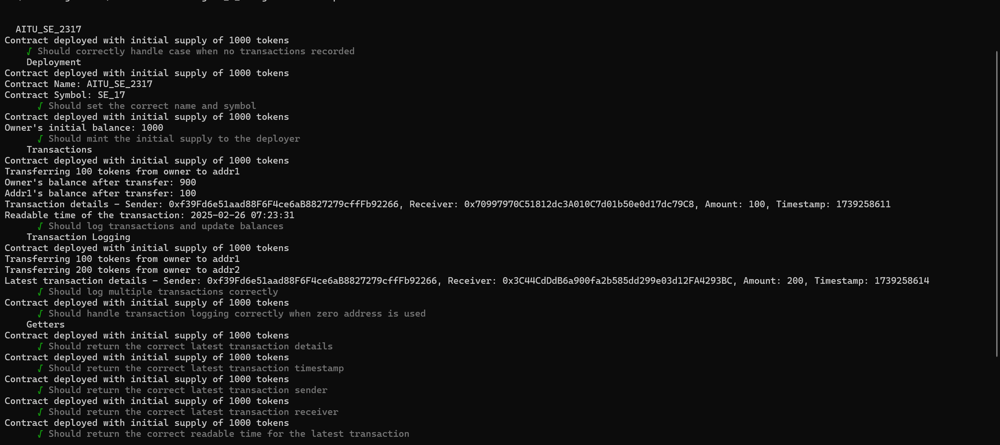

# Assignment 3, Part 2 - Blockchain Technologies 1

## Usage
This project contains test cases for the smart contract developed in Assignment 3, Part 1.  
Testing is performed using Hardhat.


## Installation and Execution
1. Make sure you have Node.js and npm installed.
2. Install dependencies:
   ```sh
   npm install
## Screenshots:


Try running some of the following tasks:
```
Title: Testing Contract
```

## Members
Nadir Shugay
Zhanbatyr Moldabek
Pavel Kan

